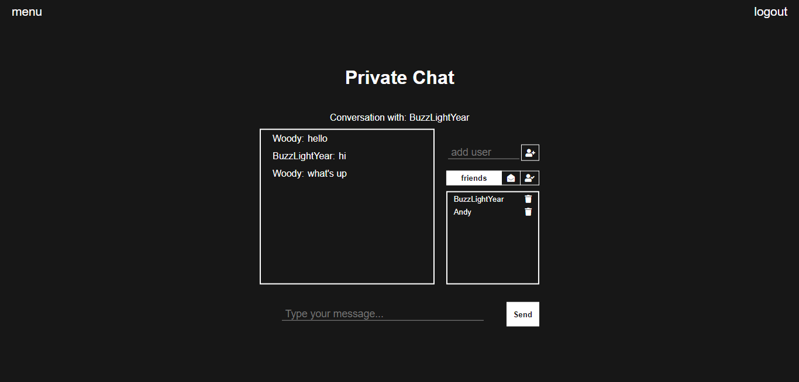

# Chat
Example of a webchat app using Spring Boot. The application using STOMP(over WebSocket) for messaging. The app allows sending a public or private message to specific user.

## Technologies
Project is created with:
* Java
* Lombok
* Spring
* Hibernate
* Thymeleaf
* PostgreSQL
* JUnit/Mockito
